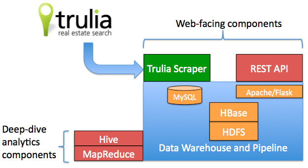
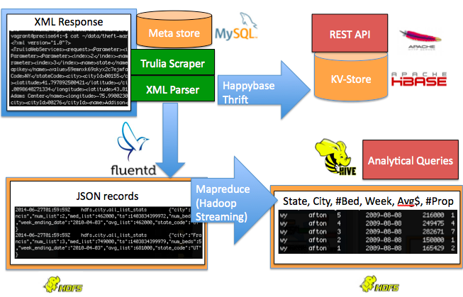

# Introduction to Theft Market
============

*Documentation is a work in progress*

Table of Contents:

1. Introduction
2. Operation 
3. Directory descriptions

## Introduction

More visibility into and organization of historical real estate listing data.  I leverage Trulia's API to gather their historic data.  See Trulia's [developer page](http://developer.trulia.com/docs/read/Home) for an overview of their API.

To bootstrap the data pipeline, Theft Market repeatedly calls Trulia's API to get the list of states, cities, and zipcodes in the US.  It parses the XML responses and puts this information into its Meta Store, a MySQL database.  The [TruliaInfoFetcher](/trulia-fetcher/TruliaInfoFetcher.py) calls getStates, getCitiesInStates, and getZipCodesInState to populate the Meta Store; see Trulia's [information library page](http://developer.trulia.com/docs/read/LocationInfo) for more about these calls.

With information about different geographic areas, Theft Market repeatedly calls Trulia's API to get real estate data about each of the areas, which takes approximately 50,000 API calls.  The [TruliaDataFetcher](/trulia-fetcher/TruliaDataFetcher.py) functions used are getStateStats, getCityStats, and getZipCodeStats; see Trulia's [stats library page](http://developer.trulia.com/docs/read/TruliaStats) for more about these calls. The results of these calls are then split in the pipeline.

The [TruliaDataFetcher](/trulia-fetcher/TruliaDataFetcher.py) uses [HappyBase](http://happybase.readthedocs.org/en/latest/) to put data directly into HBase when it finishes parsing a stats response.  Also, the stats are sent to HDFS using [FluentD](http://www.fluentd.org/) to the WebHDFS port on the HDFS NameNode. FluentD appends each record to a file of records in HDFS, and files are partitioned hourly as currently configured.  Each line of these record file includes a json dictionary for each record allowing flexibility in what was parsed out of the XML.

Subsequently, these large files in HDFS are processed by Hadoop Streaming with these [python map-reduce jobs] (https://github.com/rirwin/theft-market/tree/master/map-reduce/python).  The

## Operation

1. get data in zip file, unzip
2. run database manager to reset database tables
3. hbase shell to create tables (todo do this in HBaseManager)
2. start "info" crawler to get US metadata
3. start fluentd
4. start thrift server
5. run script to read in unzipped data
6. run mapreduce job to put in nice format
7. Hive script to setup external tables

Step 5 enables web api
Step 6 enables hive queries

## Directory description

* conf - Configuration
* trulia-fetcher
